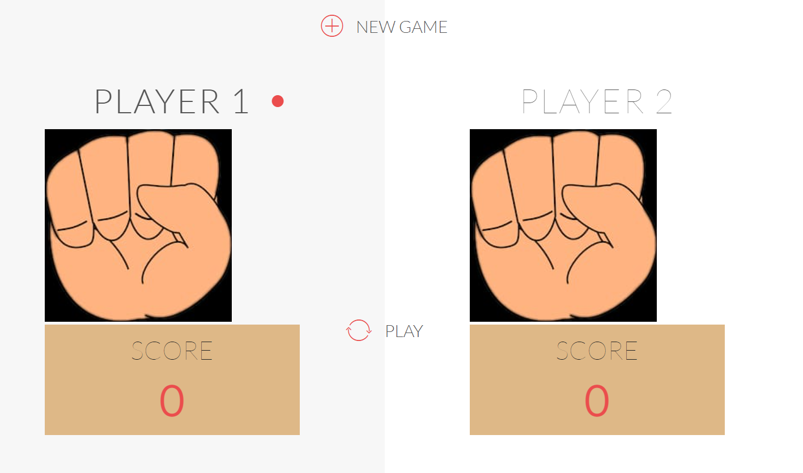
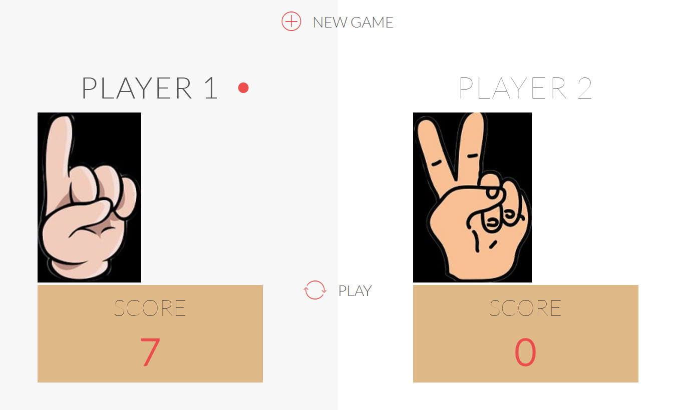
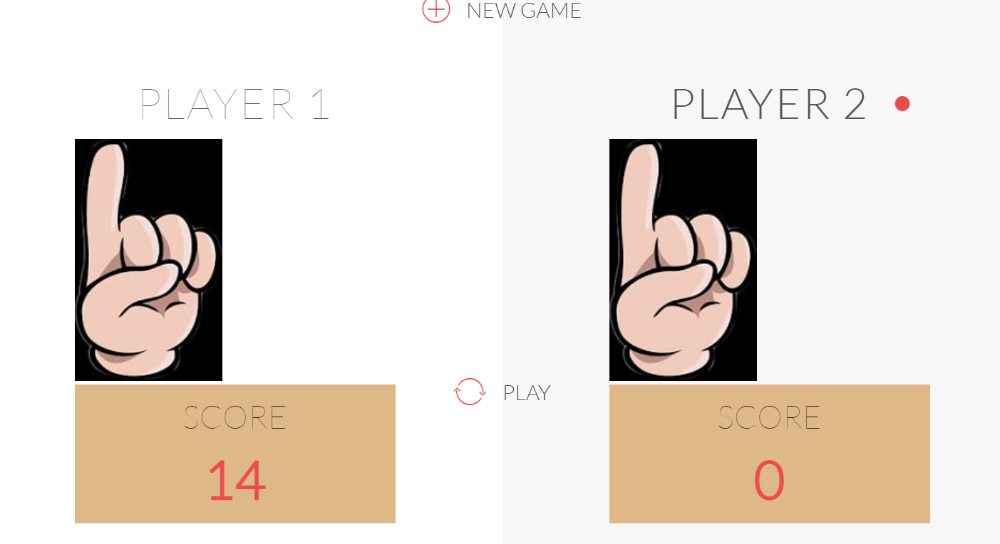
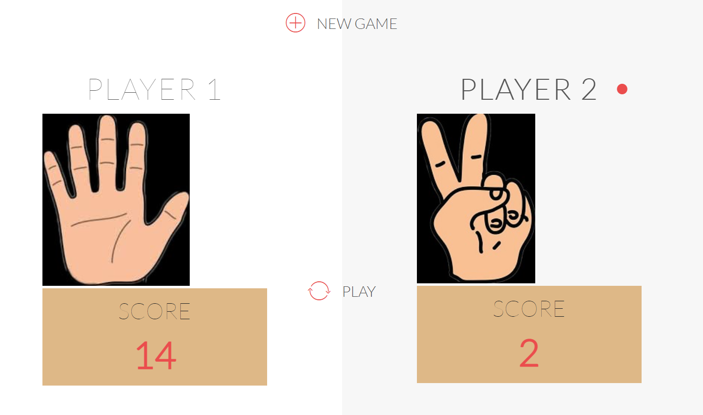
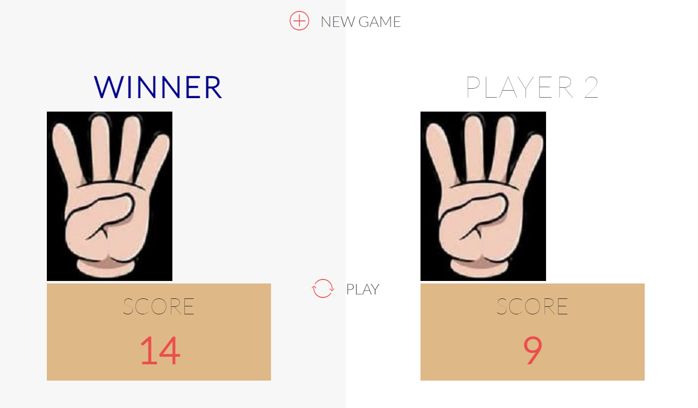

# Odd Even Game (Hand Cricket)

Odd Even Game, also known as Hand Cricket, is a web-based game that provides fun and entertainment for two players. The game is built using HTML5, CSS3, and JavaScript, offering an engaging user experience with a simple yet exciting gameplay mechanic.

## Getting Started

To start the game, follow these steps:

1. **Download and Extract**: Download the ZIP file containing the game, and extract all the files to a desired location on your computer.
2. **Open the Game**: Navigate to the extracted folder and open `index.html` in your preferred web browser.
3. **Enjoy the Game**: Once the game loads, you're ready to play and have fun!

## How to Play

1. **Starting the Game**: Click on the **START GAME** button to begin.

    

2. **Player 1's Turn**: Player 1 starts the game by clicking the **Play** button repeatedly. The hand action will correspond to a randomly generated score.

    

3. **Getting Out**: If both players show the same number on their hands, the player is considered **OUT**. The turn immediately switches to the next player.

    

4. **Player 2's Turn**: After Player 1 gets out, it's Player 2's turn to play by following the same steps as Player 1.

    

5. **Winning the Game**: The player with the highest score after both players have been out wins the game. A winning message will be displayed to indicate the victor.

    

## Game Rules

- The game is played between two players, taking turns to score runs.
- Each turn, players click the **Play** button, generating a random number between 1 to 6, which corresponds to their score for that action.
- If both players' hands show the same number at any point during a turn, the current player is out.
- After both players have taken their turns, the player with the highest cumulative score wins.

## Technical Details

- **Frontend Technologies**: The game is built with HTML5 for the structure, CSS3 for styling, and JavaScript for game logic and interactivity.
- **Compatibility**: The game runs on modern web browsers with support for HTML5, CSS3, and JavaScript.

## Troubleshooting

- Ensure you are opening the `index.html` file in a modern browser that supports HTML5, CSS3, and JavaScript.
- If the game does not start, try refreshing the browser or clearing the cache.
- For the best experience, disable any browser extensions that may block scripts or content.

## Contributing

If you would like to contribute to the project, please follow these steps:

1. Fork the repository.
2. Create a new branch (`feature/your-feature-name`).
3. Commit your changes (`git commit -m 'Add some feature'`).
4. Push to the branch (`git push origin feature/your-feature-name`).
5. Open a pull request.

## License

This project is open source and available under the [MIT License](LICENSE).
