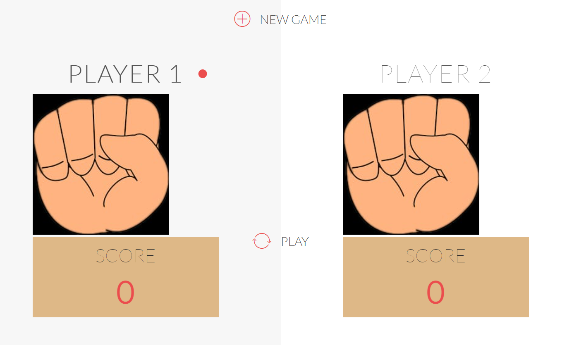
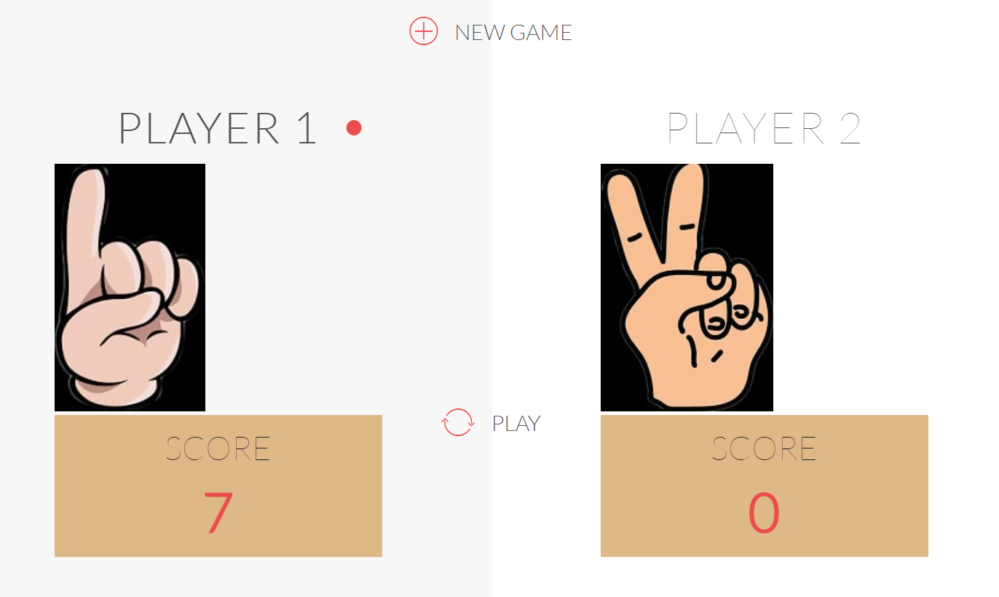
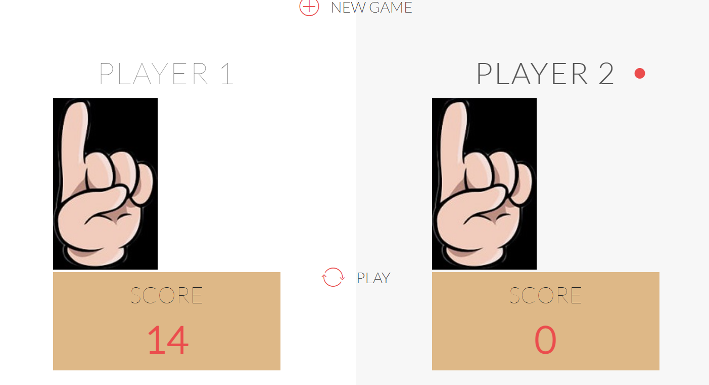
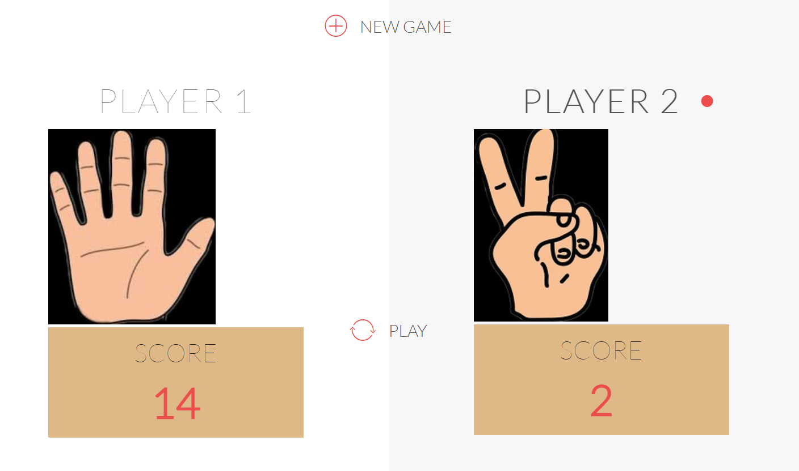
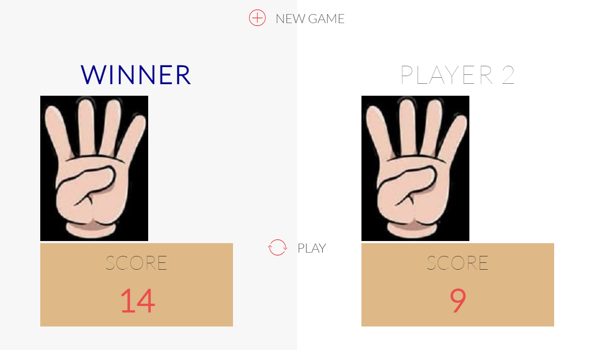

# Odd Even Game (Hand Cricket)


> **Developed by Alan Cyril Sunny**  
> If you find this project helpful, please consider ⭐ [starring the repository](https://github.com/dragonpilee/Odd-Even-HandCricket)!

---

## 🎮 Getting Started

1. **Download and Extract**: Download the ZIP file containing the game, and extract all the files to a desired location on your computer.
2. **Open the Game**: Navigate to the extracted folder and open `index.html` in your preferred web browser.
3. **Enjoy the Game**: Once the game loads, you're ready to play and have fun!

---

## 🕹️ How to Play

1. **Starting the Game**: Click on the **START GAME** button to begin.

    

2. **Player 1's Turn**: Player 1 starts the game by clicking the **Play** button repeatedly. The hand action will correspond to a randomly generated score.

    

3. **Getting Out**: If both players show the same number on their hands, the player is considered **OUT**. The turn immediately switches to the next player.

    

4. **Player 2's Turn**: After Player 1 gets out, it's Player 2's turn to play by following the same steps as Player 1.

    

5. **Winning the Game**: The player with the highest score after both players have been out wins the game. A winning message will be displayed to indicate the victor.

    

---

## 📜 Game Rules

- The game is played between two players, taking turns to score runs.
- Each turn, players click the **Play** button, generating a random number between 1 to 6, which corresponds to their score for that action.
- If both players' hands show the same number at any point during a turn, the current player is out.
- After both players have taken their turns, the player with the highest cumulative score wins.

---

## 🛠️ Technical Details

- **Frontend Technologies**: HTML5 (structure), CSS3 (styling), JavaScript (game logic and interactivity)
- **Compatibility**: Runs on modern web browsers with support for HTML5, CSS3, and JavaScript

---

## 🐞 Troubleshooting

- Ensure you are opening the `index.html` file in a modern browser that supports HTML5, CSS3, and JavaScript.
- If the game does not start, try refreshing the browser or clearing the cache.
- For the best experience, disable any browser extensions that may block scripts or content.

---

## 🤝 Contributing

Contributions are welcome! If you'd like to contribute to this project, please follow these steps:

1. **Fork the repository**
2. Create a new branch  
   ```bash
   git checkout -b feature/your-feature-name
   ```
3. Commit your changes  
   ```bash
   git commit -m 'Add some feature'
   ```
4. Push to the branch  
   ```bash
   git push origin feature/your-feature-name
   ```
5. Open a pull request

---

## 📄 License

This project is open source and available under the [MIT License](LICENSE).

---

For more information, updates, and documentation, visit the  
👉 [GitHub Repository](https://github.com/dragonpilee/Odd-Even-HandCricket)

Feel free to fork, star ⭐, and contribute!
